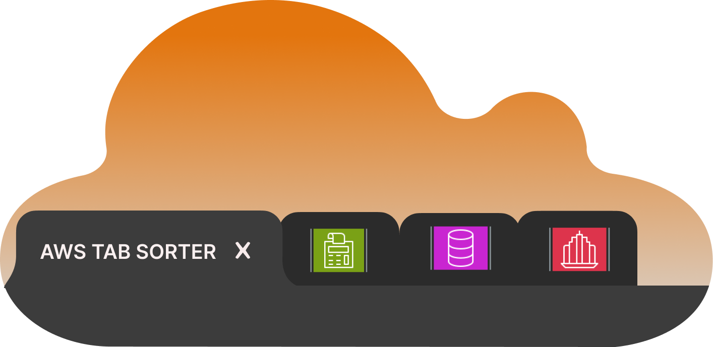

# AWS TAB SORTER 


I was bored on the train and made this quick little extension to sort and categorize my aws tabs. 

This program uses the chrome api to detect aws tabs, based on their urls, and then group them by either their Service (ECS, ECR, Cloud9, etc.) or their categories (Front-end Web & Monitoring, Storage, Dev Tools, etc.). All of these categories are based off of the AWS all services page in the aws console. the services and their categories are saved in the services.js file. 


This extension is currently up for review to be published, however if you would like to deploy it locally and use the extension clone this repo and follow these steps:

1) top right extensions logo: 

    

2) left click and select Manage Extensions:
    
    
3) select developer mode 
4) select Load unpacked and add navigate to the aws-tab-sorter/app file 

    

To add new groups or services just edit the services.js file:

For those curious I just downloaded the html from AWS Services to get the names and categories for each service. 
You can see that code here: [aws-scrape.py](./aws-scrape.py)

```
var services = {
    "AWS Gov Cloud": {
        "link": "aws.amazon.com/govcloud-us",
        "category": "AWS Gov Cloud"
    },
    "AWS Sign In": {
        "link": "signin.aws.amazon.com",
        "category": "AWS Sign In"
    },
    "Docs": {
        "link": "docs.aws.amazon.com",
        "category": "AWS Docs"
    },
    "AWS Console": {
        "link": "aws.amazon.com/console",
        "category": "AWS Console"
    },
    "EC2": {
        "link": "aws.amazon.com/ec2",
        "category": "Compute"
    },
    ...
}

```